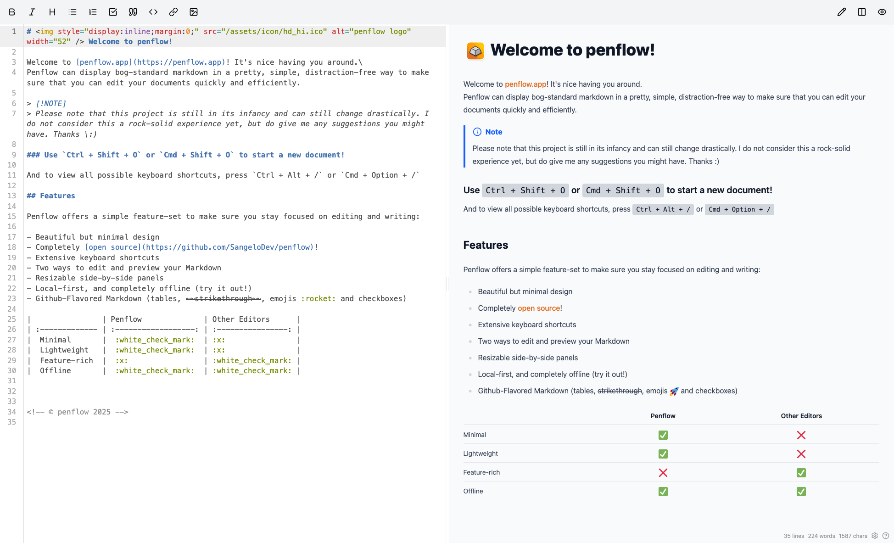

<div align="center"></div>

# penflow

> [!NOTE]
> Please note that this project is still in its infancy and can still change drastically. I do not consider this a rock-solid experience yet, but do give me any suggestions you might have. Thanks :)

A simple, clean, distraction-free Markdown Editor PWA with offline-support made with Svelte & Tailwind. Try it out now on [penflow.app](https://penflow.app)!

- [Why does this exist?](#why-does-this-exist)
- [Features](#features)
- [Development](#development)
- [Contributions](#contributions)
- [License](#license)

## Why does this exist?

Yes, I know this is _yet another_ markdown editor, but I really felt a need for a markdown editor that's clean, distraction-free,
and accessible everywhere. This project also serves as a way for me to learn more about web-development, so it's a 'two-birds-with-one-stone'
type of situation. If this doesn't serve your needs, you can skip this project (which is completely fine) or contribute to make it better!

## Features



Penflow offers a simple feature-set to make sure you stay focused on editing and writing:

- Beautiful but minimal design
- Completely [open source](./LICENSE)!
- Extensive keyboard shortcuts
- Two ways to edit and preview your Markdown
- Resizable side-by-side panels
- Local-first, and completely offline (try it out!)
- Github-Flavored Markdown (tables, ~~strikethrough~~, emojis :) and checkboxes)

|              | Penflow | Other Editors |
| :----------- | :-----: | :-----------: |
| Minimal      |   ✅    |      ❌       |
| Lightweight  |   ✅    |      ❌       |
| Feature-rich |   ❌    |      ✅       |
| Offline      |   ✅    |      ✅       |

## Development

To compile Penflow locally on your machine, first clone the repository, and run the following commands:

```bash
# install dependencies
pnpm i

# run dev server
pnpm dev

# build and preview penflow
pnpm build && pnpm preview
```

## Contributions

Contributions are always welcome, please just open an issue or pull-request.

## License

This project is licensed under the [GNU AGPLv3](./LICENSE) license.
